# Queue Management App 🚶‍♂️🚶‍♀️

A modern, real-time solution designed to streamline customer flow and eliminate physical waiting lines. This application allows organizations to manage queues digitally, providing a better experience for both staff and customers.

## 🚀 Overview

The **Queue Management App** is built to solve the common problem of long, unorganized physical queues in banks, hospitals, and service centers. It provides a virtual queuing environment where users can join a line and track their status in real-time.

## 📸 App Screenshots

### 🔑 Authentication & Onboarding

| Welcome Screen | Login | Register |
| --- | --- | --- |
| 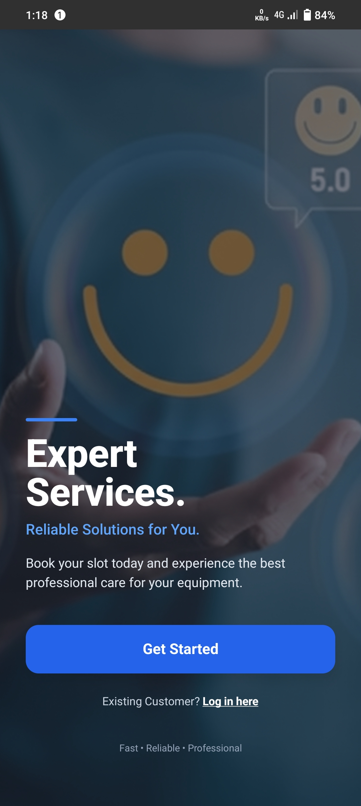 | 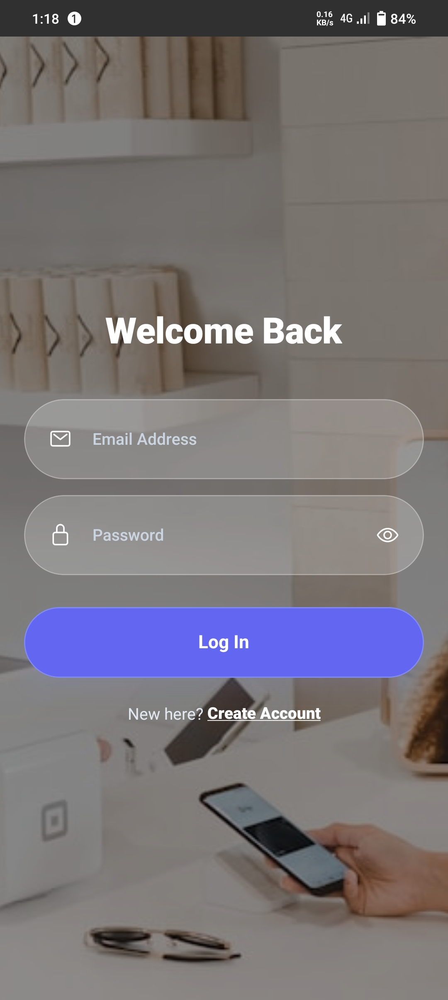 | 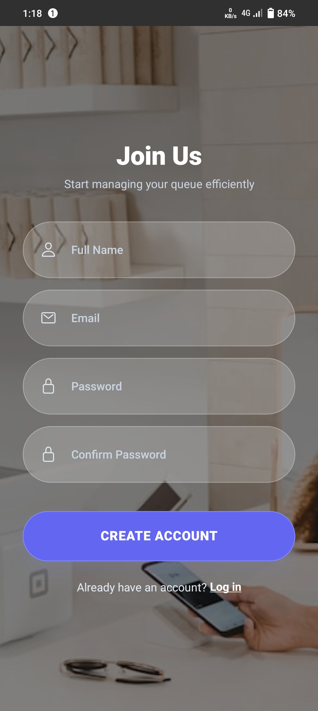 |

### 📊 Home & Profile 

| Home Screen | Profile |
| --- | --- |
| 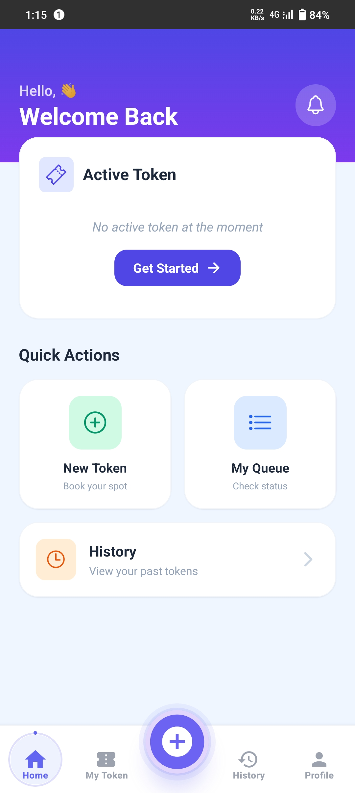 | 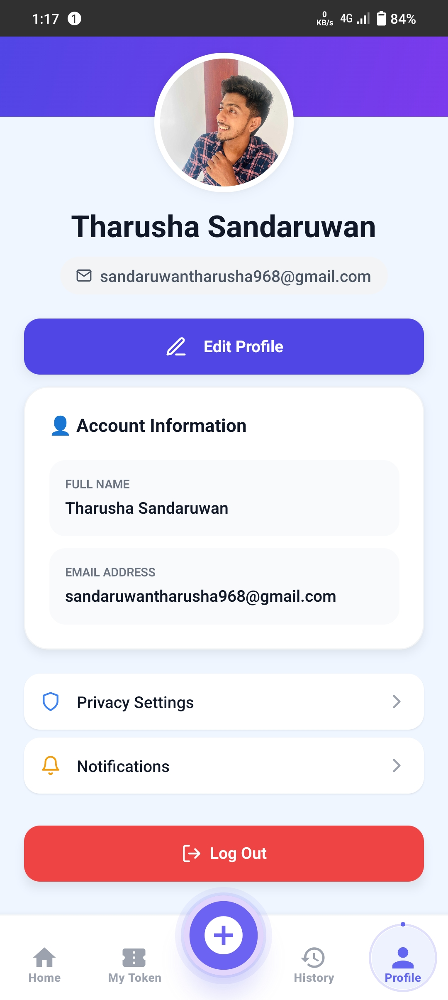 |

### 🎫 Token Generation Flow

| Add Token | Service Center |
| --- | --- |
| 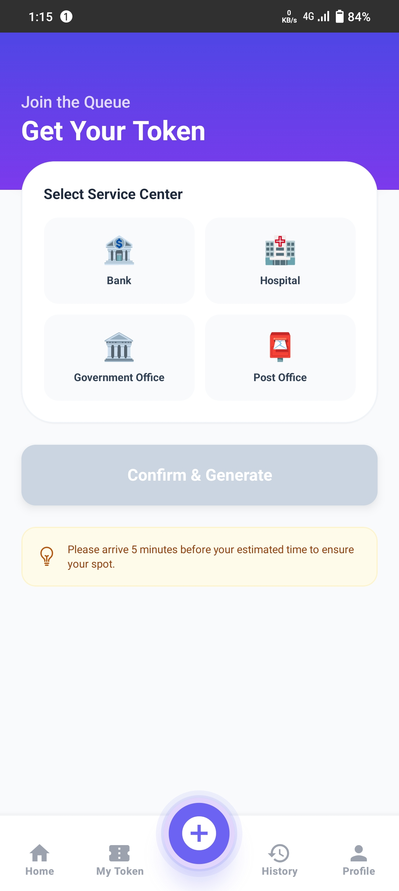 | 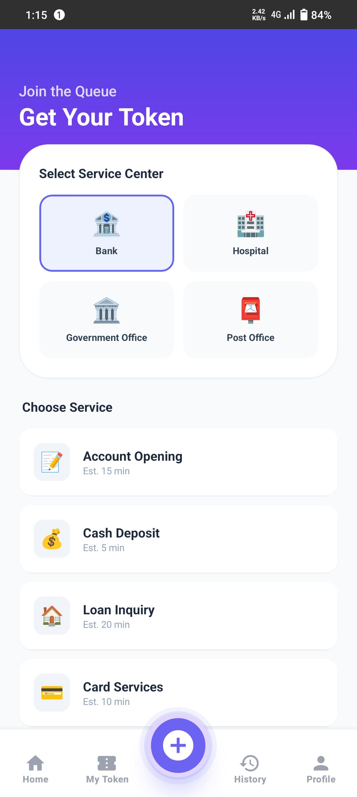 |

| Select Service | Generated Token |
| --- | --- |
| 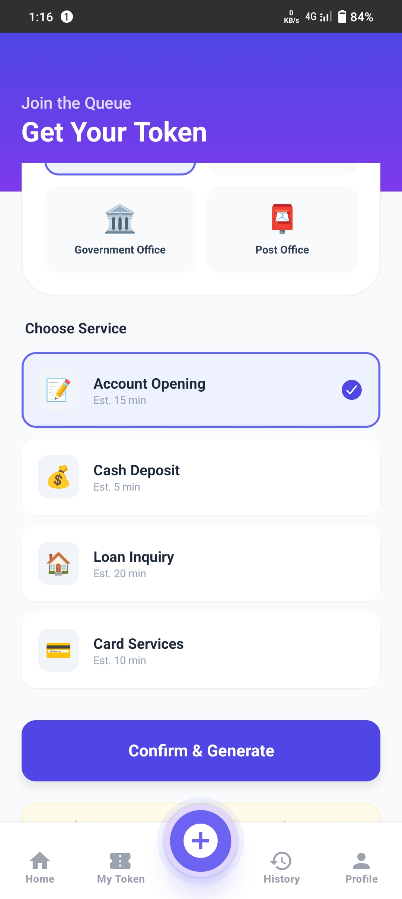 | 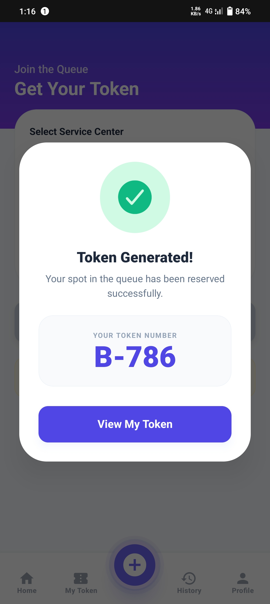 |

### 📊 Token Management

| Active Tokens | Token History |
| --- | --- |
| 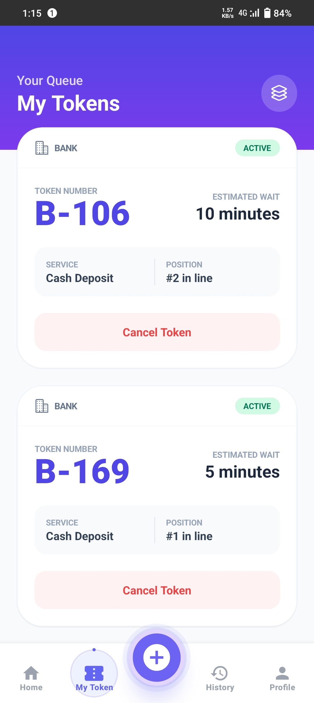 | 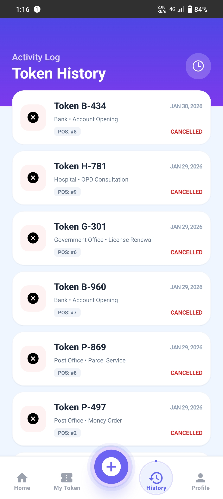 |


## ✨ Key Features

* **Virtual Check-in:** Join the queue remotely without standing in a physical line.
* **Real-time Updates:** View your current position and estimated waiting time via Firestore.
* **Multi-Category Support:** Manage different queues for different services (e.g., "Cashier," "Inquiries," "Support").
* **Token Generation:** Unique digital tokens for every user.
* **Profile Management:** Users can upload profile pictures using Cloudinary.

## 🛠️ Tech Stack

* **Frontend:** React Native (Expo) with **TypeScript**
* **Backend:** Firebase Authentication & Cloud Firestore
* **Navigation:** Expo Router (File-based)
* **Build Tool:** Expo Application Services (EAS)
* **Styling:** NativeWind (Tailwind CSS)
* **Image Hosting:** Cloudinary

## 📋 Prerequisites

Make sure you have the following installed:

* **Node.js:** v18 or higher (LTS recommended)
* **npm:** (Comes with Node.js)
* **EAS CLI:** `npm install -g eas-cli` (For building APKs)
* **Expo Go:** Download on your device to test in development.


## 🔥 Firebase Configuration

Follow these steps to connect the app to your Firebase project:

1. **Create Project:** Go to the [Firebase Console](https://console.firebase.google.com/) and create a new project.
2. **Add App:** * Click the **Web** (</>) icon to add an app to your project.
* Enter an **App Nickname** (e.g., `Queue-App`).
* Click **Register App**.


3. **Install Firebase:** Run the following command in your project terminal:
```bash
npm install firebase

```


4. **Initialize Firebase:**
* In your project's `src` or root directory, create a file named `firebase.ts`.
* Copy the **Firebase SDK snippet** provided in the console and paste it into `firebase.ts`.
* It should look something like this:


```typescript
import { initializeApp } from "firebase/app";
import { getFirestore } from "firebase/firestore";
import { getAuth } from "firebase/auth";

const firebaseConfig = {
  apiKey: "YOUR_API_KEY",
  authDomain: "YOUR_AUTH_DOMAIN",
  projectId: "YOUR_PROJECT_ID",
  storageBucket: "YOUR_STORAGE_BUCKET",
  messagingSenderId: "YOUR_SENDER_ID",
  appId: "YOUR_APP_ID"
};

const app = initializeApp(firebaseConfig);
export const db = getFirestore(app);
export const auth = getAuth(app);

```


5. **Finalize:** Click **Continue to console** in the Firebase dashboard.

---


## ☁️ Cloudinary Configuration

ServiceCenters uses Cloudinary for profile pictures.

1. **Get Cloud Name:** Copy your Cloud Name from the [Cloudinary Dashboard](https://cloudinary.com/console).
2. **Enable Unsigned Uploads:** - Go to **Settings > Upload**.
* Under **Upload presets**, click "Enable unsigned uploading".


3. **Create Upload Preset:**
* Add a new preset, set **Signing Mode** to **Unsigned**.
* Copy the **Upload preset name** (e.g., `ml_default`).


4. **Update `.env`:**
```env
EXPO_PUBLIC_CLOUDINARY_CLOUD_NAME=your_cloud_name
EXPO_PUBLIC_CLOUDINARY_UPLOAD_PRESET=your_preset_name

```


## 📦 Installation

1. Clone the repository:
```bash
git clone https://github.com/tharu-2003/Queue-Management-App.git
cd Queue-Management-App

```


2. Install dependencies:
```bash
npm install

```


## ▶️ Running the App

Start the development server:

```bash
npx expo start

```

Scan the QR code using the **Expo Go** app on your device.

## 🤝 Contributing

Contributions are welcome!

1. Fork the Project
2. Create your Feature Branch (`git checkout -b feature/NewFeature`)
3. Commit your Changes (`git commit -m 'Add some NewFeature'`)
4. Push to the Branch (`git push origin feature/NewFeature`)
5. Open a Pull Request

## 📜 License

Distributed under the MIT License. See `LICENSE` for more information.

---

**Developed with ❤️ by [Tharusha Sandaruwan**](https://www.google.com/search?q=https://github.com/tharu-2003)

---
